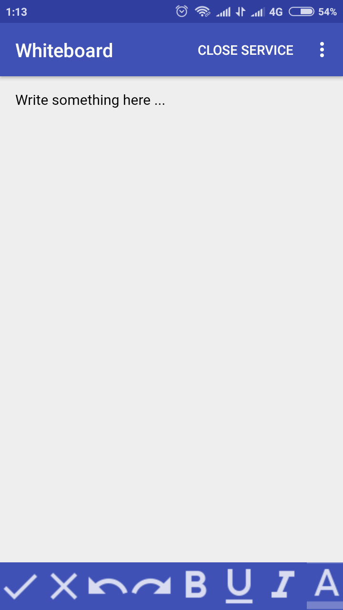

# whiteboard-app
An android app working like personal whiteboard (pocket diary) to manage todos, memos, notes etc.

### Android app link

### Features

1. Ads free and lightweight app to increase productivity.
2. It will provide you a simple editor to write your daily notes, contents, todos, memos etc and save.
3. You can even format content (bold, underline, change color etc) to have a better visualization. 

### How to use

1. Write your things on whiteboard and click on save (tick mark) button when done
2. On opening app, a notification will start appearing in notification bar for quick use.
3. You can close notification on clicking CLOSE SERVICE menu option.
4. Customize/format the content using various editor options given. 

## Screenshots
|  |  |
| --- | --- |
| | |
| | |
| | |

#### For query/issues open Github issue or contact: varunon9@gmail.com
